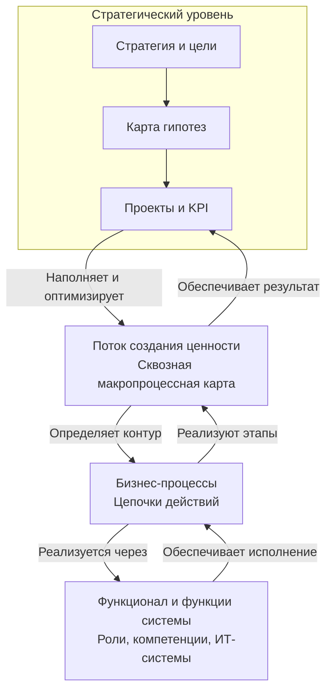
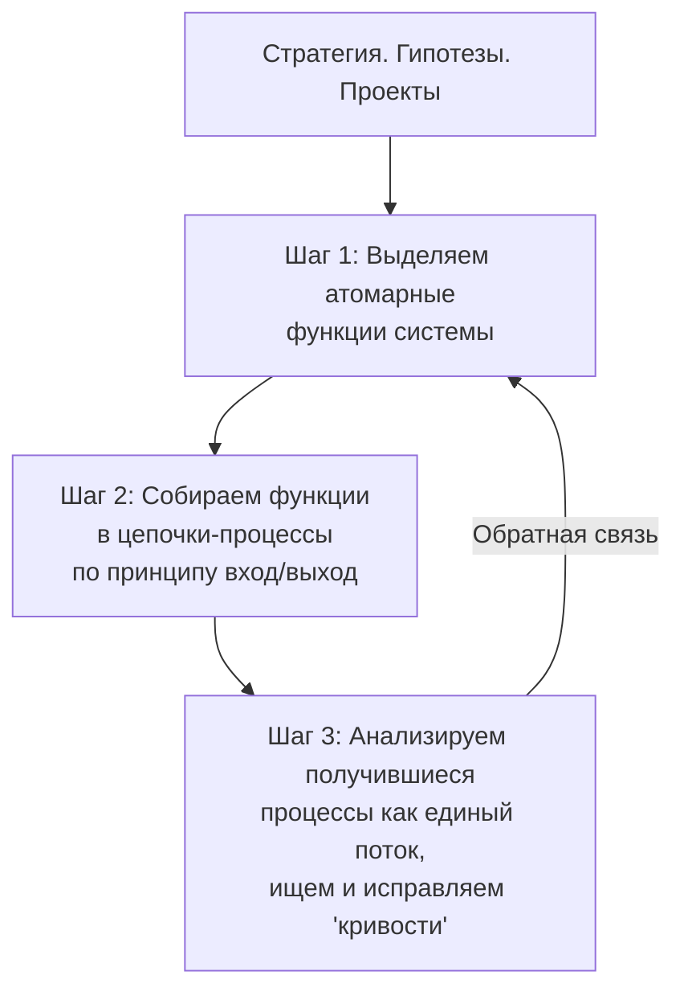

## Каскадирование целей с учетом уровней сложности

---
>*Недавно получил к ознакомлению стратегию развития компании на 5 лет, и сразу вслед за ней стратегию развития HR в компании. 
>	Первая эмоция: эпизод про русский язык из кф "72 метра".
>	Остыв, полетели следующие буквы: 
>		- я это где то видел и много раз; 
>		- две стратегии одной компании - между собой не бьются ни по смыслу не по KPI; 
>		- в одной из стратегий местами отсутствуют сроки, ответственные и показатели.
>	Ну и чтоб успокоиться, с командой обсудили как делать нельзя.*

---

Каскадирование целей — это не просто механическое «дробление» больших целей на маленькие. Это процесс **адаптации смысла и содержания стратегии к уровню сложности и специфике каждой подсистемы компании**. И здесь системный подход, дает прекрасный объяснительный и практический инструментарий.

### 1\. Краткое напоминание: Классическое каскадирование целей (BSC, KPI)

Это процесс трансляции стратегии с верхнего уровня организации (корпоративная стратегия) на уровень бизнес-единиц, департаментов, команд и, в конечном итоге, отдельных сотрудников. Используются такие инструменты, как:

- **Стратегическая карта (Strategy Map)**:
- **Дерево целей**:
- **Показатели (KPI)** и **целевые значения**.
- **Инициативы** и **проекты**.

**Проблема классического подхода:** Он часто рассматривает организацию как простой «механизм», где цели как шестеренки, должны просто сцепиться друг с другом. Но организация — это **сложная адаптивная система**, и разные ее части функционируют по-разному.

## Технология каскадирования

---
>*"Ты мне скажи как надо, как не надо я и сам знаю".
>Стоит рассмотреть следующую цепочку: 
>	1. есть системы, 
>	2. у систем есть вложенная сложность (7 уровней), 
>	3. при взаимодействии систем 4 уровня есть поле целей, 
>	4. выбираем цели из этого поля, 
>	5. для достижения целей прорабатываем стратегии их достижения (тут пригодятся знания из военной области), 
>	6. выбрав стратегии мы строим гипотезы как мы будем достигать цели (здесь отлично подходит карта гипотез Александра Бындю), 
>	7. а собственно из шагов карты рождаются KPI и проекты нижне уровневых подсистем.*

---

Вот как это выглядит в виде последовательности шагов:

### Системы и их вложенная сложность: основа для целеполагания

Любая организация — это **сложная система**, состоящая из множества взаимодействующих подсистем (отделов, команд, процессов). Эти подсистемы имеют разный уровень сложности, который требует адекватного языка управления.

Вот эти семь уровней сложности, согласно С. Хапрову:

| Уровень | Название | Ключевая характеристика | Пример в организации |
| --- | --- | --- | --- |
| **1** | **Объект** | Операции с объектами, базовые действия. | Рабочий на конвейере, закручивающий гайку. |
| **2** | **Проект** | Наличие простого плана, идеи. | Инженер, составляющий инструкцию для сборщиков. |
| **3** | **Программа** | Знание, *как* реализовать идею, владение инструментами. | Главный инженер, создающий схему производства. |
| **4** | **Стратегия** | **Критическое мышление, видение ошибок и путей развития.** | Менеджер, меняющий стратегию завода. |
| **5** | **Политика** | Определение общих правил и целей для создания систем. | Правительство, меняющее политическую структуру. |
| **6** | **Идеология** | Формирование картины мира, ценностей, смыслов. | — |
| **7** | **Философия** | Осмысление фундаментальных основ бытия и деятельности. | — |

**Ключевой тезис Хапрова**, который проходит красной нитью через все его работы: **"Сложностью управляет тот, кто сложнее"**. Это означает, что управляющая система (руководитель, управленческая методология) должна быть по своему уровню сложности выше управляемой системы. Если чиновник (простая система) пытается управлять мегаполисом (сверхсложная система) — неизбежны кризисы и катастрофы. В бизнесе то же самое: нельзя управлять отделом R&D (уровень 5-6) языком KPI и регламентов (уровень 1-2).

### 1. Поле целей на 4-м уровне: где рождается стратегия

Как видно из таблицы, **стратегия — это четвертый уровень сложности**. Это первый уровень, где возникает **критическое мышление** и системное видение.

- **Что происходит на этом уровне?** Руководитель видит не просто отдельные проекты и программы, а всю систему в целом, ее взаимосвязи, слабые места и точки роста. Он способен не только реализовывать планы, но и **определять эти планы**, выбирать направления, оценивать риски и корректировать курс.
- **Какие цели здесь возникают?** Это и есть те самые **стратегические цели**. Они формулируются не как конкретное действие ("сделать Х"), а как **вектор движения** ("увеличить долю на рынке", "стать самым любимым брендом", "создать инновационную культуру"). Эти цели отвечают на вопрос "Куда мы идем?" и "Почему мы это делаем?".

Цели, рожденные на этом уровне, по своей природе предназначены для **каскадирования вниз** на более простые уровни системы.

### 2. Стратегия достижения: военная семантика

- **Стратегия (по Клаузевицу)** *есть использование боя с целью выиграть войну; следовательно, она должна поставить цель всем военным действиям. Иными словами, стратегия формирует план войны и связывает с поставленной целью ряд действий, которые должны привести к достижению этой цели, то есть составляет планы отдельных кампаний и ставит задачи перед каждым сражением.*  
В бизнес-контексте: это искусство комбинирования **ограниченных ресурсов** и инициатив для достижения стратегической цели в условиях конкуренции и неопределенности.
- **Тактика —** это способ победы в отдельном сражении (конкретном проекте или кампании).
- **Оперативное искусство —** это мост между стратегией и тактикой, искусство планирования и проведения крупных операций (комплексов проектов).

**Как это применить?** Формулируя стратегию, задайте вопросы:

- **Кто наш «противник»?** (Конкуренты, инерция, рыночные условия).
- **На каком «театре военных действий» мы действуем?** (Рынок, сегмент, цифровая среда).
- **Каковы наши ключевые «силы» и «слабости»?** (SWOT-анализ).
- **Где наше «решающее преимущество»?** (Уникальное торговое предложение, инновация).
- **Какие «сражения» нам нужно выиграть?** (Ключевые инициативы).

### 3. [[Карта гипотез]] Александра Бындю: перевод стратегии в гипотезы

Выбранная высокоуровневая стратегия часто основана на предположениях. Здесь на помощь приходит **«Карта гипотез»** — метод, который превращает стратегию из набора догадок в структурированную систему проверяемых гипотез.

Ее суть — в четкой причинно-следственной логике:  
**Если** мы предпримем это действие (X),  
**то** это приведет к изменению в поведении субъекта (Y),  
**потому что** сработает определенный механизм (Z),  
**и в результате** мы приблизимся к стратегической цели.

**Пример для цели «Увеличить лояльность»:**

- **Гипотеза:***«Если* мы внедрим программу лояльности с персональными скидками (X), *то* клиенты увеличат частоту покупок на 15% (Y), *потому что* это создаст ощущение эксклюзивности и выгоды (Z), *и в результате* мы повысим общий показатель LTV и долю рынка».

Этот подход позволяет:

- **Снизить риски:** Неудачная гипотеза — это не провал всей стратегии, а ценный урок.
- **Фокусировать ресурсы:** Инвестировать только в те инициативы, гипотезы которых подтвердились.
- **Донести смысл:** Каждый участник понимает, *зачем* он делает ту или иную задачу.

### 4. Рождение KPI и проектов: каскадирование на нижние уровни

Подтвержденные гипотезы из Карты становятся источником действий для систем более низких уровней сложности.

- **Для уровня 3 (Сложные системы / Тактика):** Формулируются **тактические цели (OKR)** и **ключевые показатели эффективности (KPI)**, которые измеряют прогресс в реализации гипотез.
	- *Пример KPI:* «Увеличить конверсию на этапе оформления заказа на 5%», «Снизить стоимость привлечения клиента на 10%».
- **Для уровней 1-2 (Простые системы / Операции):** KPI и тактические цели декомпозируются в конкретные **операционные задачи, проекты и регламенты**. Это уровень конкретных действий, поручений и ежедневных процедур.
	- *Пример проекта:* «Разработать и запустить мобильное приложение с программой лояльности к Q3».
	- *Пример регламента:* «Внести изменения в скрипты колл-центра в соответствии с новой программой лояльности».

### Замыкание цикла: непрерывная обратная связь

Важно помнить, что этот процесс не линейный, а **циклический и итерационный**.

1. **KPI** и результаты **проектов** постоянно мониторятся.
2. Эти данные используются для **проверки гипотез**. Гипотеза может подтвердиться, может потребовать корректировки, а может оказаться неверной.
3. **Обновленные данные** по гипотезам могут привести к **корректировке стратегии** и даже **пересмотру целей**.
4. Таким образом, нижние уровни системы не просто исполняют приказы, а поставляют ценнейшую информацию для принятия решений на верхних уровнях.

### Целостная картина управления

Предложенная технология создает адаптивный и осмысленный контур управления:

**Уровни сложности систем → Поле стратегических целей (Ур. 4) → Военная стратегия → Карта гипотез → Тактические KPI (Ур. 3) → Операционные проекты и задачи (Ур. 1-2)** → **Обратная связь и корректировка**.

Этот подход позволяет **переводить** стратегический замысел с языка сложных систем на языки более простых подсистем, сохраняя смысл и обеспечивая гибкость в условиях неопределенности.

>*Что строится дальше, чтобы эти проекты были реализованы, а KPI — достигнуты?*
---
## Поток - Процессы - Функции

---
>*Как говорит классика и как видится иерархия, даже со стороны ранее предложенной системы уровней сложности.
>Однако...*

### Как это все собрано воедино?

После этапа стратегического планирования выстраивается следующая цепочка:

1. **Поток создания ценности:** Определяем, какой сквозной путь должна пройти ценность для клиента, чтобы наша стратегическая гипотеза сработала.
2. **Бизнес-процессы:** Детализируем поток в регламентированные последовательности действий (процессы), назначаем владельцев, определяем метрики эффективности этих процессов.
3. **Функционал:** Обеспечиваем процессы необходимыми ресурсами: формируем команды, определяем роли и зоны ответственности (организационный функционал) и дорабатываем/внедряем необходимые ИТ-системы с нужными **функциями**.

---

---

Таким образом, **поток** задает направление, **процессы** являются механизмом исполнения, а **функционал** — это люди и технологии, которые приводят этот механизм в движение. Это и есть операционная система компании, которая выстраивается для реализации стратегии.

>*Очередной сферический конь в вакууме...*
>*Ну покажите реальное предприятие, где все собрано по такой схеме от начала до конца*

## Функции - Процессы - Поток
---
>*Когда мы посмотрели на систему, поле целей и выстроили проекты для её реализации, мы еще не понимаем -  как выстроить поток и какие бизнес процессы нужны.
>Но очевидно, какие функции должны реализовываться системой, поэтому 
>	определяем функции, 
>	определяем взаимодействие, входы, выходы, 
>	смотрим на поток, 
>	исправляем кривости*

---

### 1. Определяем функции системы

После формирования стратегических гипотез и проектов часто непонятно, как должен выглядеть идеальный поток, но очевидно, **какие конкретные возможности (функции) должны появиться у системы** для проверки этих гипотез.

- **Что такое «функция» в этом контексте?** Это атомарная, неделимая возможность или действие, которое может быть выполнено системой (под системой можно понимать как ИТ-платформу, так и отдел, или даже конкретного сотрудника).
- **Как это делать?** Мы выписываем все функции, необходимые для реализации наших проектов и гипотез, в виде списка или таблицы. Это сущности без привязки к последовательности.
- **Пример для гипотезы о программе лояльности:**
	- `Функция 1:`**Сгенерировать уникальный промокод**
	- `Функция 2:`**Отправить email с приветствием**
	- `Функция 3:`**Начислить бонусы на счет клиента**
	- `Функция 4:`**Проверить статус клиента (новичок/постоянный)**
	- `Функция 5:`**Отобразить баланс бонусов в личном кабинете**

---

### 2. Определяем взаимодействия: входы и выходы (формируем процессы)

Следующий шаг — мы берем наши разрозненные «кирпичики» (функции) и начинаем соединять их в логические цепочки. Мы задаем вопросы:

- *Что нужно на входе для работы этой функции? (Вход)*
- *Что является результатом ее работы? (Выход)*
- *Результат работы какой функции является входом для следующей?*

**Так рождаются процессы.** Процесс — это и есть цепочка взаимосвязанных функций, где выход одной является входом для другой.

- **Пример сборки процесса «Регистрация в программе лояльности»:**
	1. **Событие:** Клиент нажимает «Получить карту».
	2. **Функция 4:***Проверить статус клиента* → *Выход:* статус = «новичок».
	3. **Функция 1:***Сгенерировать уникальный промокод* → *Выход:* код = «WELCOME15».
	4. **Функция 2:***Отправить email с приветствием и кодом* → *Выход:* email отправлен.
	5. **Функция 3:***Начислить бонусы на счет* → *Выход:* на счету 500 бонусов.
	6. **Конец процесса.**

На этом этапе мы не думаем о глобальной оптимизации. Мы просто соединяем функции в работоспособные цепочки, чтобы проверить наши гипотезы.

---

### 3. Смотрим на поток и исправляем «кривости»

Когда у нас есть несколько таких микро-процессов, мы можем подняться на уровень выше и посмотреть на них как на единое целое — **[[Поток создания ценности]] (Value Stream)**.

- **Что мы делаем?** Мы картируем (рисуем) всю последовательность процессов от старта (первый контакт с клиентом) до финиша (получение ценности клиентом и компанией).
- **Что мы ищем?** Мы ищем «кривости» — узкие места, потери, дублирование функций, разрывы, лишние шаги.
	- *Потери времени:* Ожидания между процессами.
	- *Потери качества:* Ручное переключение между системами, ошибки.
	- *Лишние действия:* Функции, которые не добавляют ценности.
- **Пример «кривости»:** После процесса «Регистрация» данные о новом участнике программы вручную выгружаются в Excel и только потом импортируются в систему email-рассылок. Это разрыв между функциями `Начислить бонусы` и `Отправить приветственный email`.

**Исправление:** Мы проектируем новую, более целостную **функцию системы** — `Интегрировать CRM с сервисом рассылок`, которая автоматически передает данные. Это убирает ручной труд и ускоряет весь поток.

---

### Итоговый итеративный алгоритм

Это не линейный процесс, а цикл постоянной доработки и оптимизации.

Diagram

---

---

**Преимущества подхода (снизу вверх):**

1. **Сфокусирован на реализации:** Мы начинаем не с абстрактного идеала, а с конкретных шагов, которые нужно сделать *прямо сейчас*.
2. **Гибкость и адаптивность:** Если гипотеза не подтвердится, мы легко можем пересобрать процессы из других функций или отбросить ненужные. Мы не перестраиваем всю идеально выстроенную, но неработающую систему.
3. **Более быстрое получение результата:** Мы быстрее запускаем «минимально жизнеспособный процесс» для проверки идеи.
4. **Естественность:** Так обычно и происходит в реальности: сначала появляется разрозненный функционал, который потом начинают упорядочивать.

Этот подход очень близок к **Agile-методологиям** и **теории ограничений (Theory of Constraints)**, где мы находим главное узкое место (слабое звено в процессе), усиливаем его (добавляем или улучшаем функцию) и смотрим, куда сместилось ограничение далее.

>*Таким образом, после стратегии чаще логичнее и практичнее двигаться **от функций к процессам и потоку**, а не наоборот. Это итеративный и более управляемый путь построения операционной эффективности.*

---
## Критерии эффективности и результативности потока

---
>*Далее как раз логично разобраться с критериями эффективности и результативности потока, здесь и появляются операционные KPI, ну и далее рождается системное управление потерями*

---

### 1. Критерии эффективности и результативности потока (Operational KPIs)

Чтобы управлять потоком, нужно понимать, насколько хорошо он работает. Мы оцениваем его по двум ключевым аспектам:

| Аспект               | Вопрос                                                                                                 | Примеры операционных KPI для потока                                                                                                                                         |
| -------------------- | ------------------------------------------------------------------------------------------------------ | --------------------------------------------------------------------------------------------------------------------------------------------------------------------------- |
| **Эффективность**    | **Делаем ли мы вещи правильно?**   Оптимально ли мы используем ресурсы? (Фокус на **ресурсы**)         | • **Время выполнения заказа (Order Lead Time)**   • **Производительность** (единиц в час)   • **Стоимость единицы продукции/услуги**   • **Загрузка мощностей/сотрудников** |
| **Результативность** | **Делаем ли мы правильные вещи?**   Получаем ли мы нужный нам итоговый результат? (Фокус на **выход**) | • **Качество продукции (% брака)**   • **Выход годных изделий**   • **Точность выполнения заказа (полнота, срок)**   • **Удовлетворенность клиента на выходе (CSAT)**       |

**Как это работает на примере потока «Участие в программе лояльности»:**

- **KPI Эффективности:**
	- *Время от заявки до активации карты:***Цель: < 1 часа.**
	- *Трудозатраты менеджера на одну заявку:***Цель: 5 минут.**
	- *Стоимость привлечения одного участника программы:***Цель: 150 руб.**
- **KPI Результативности:**
	- *Доля успешно активированных карт от всех заявок:***Цель: 99%.**
	- *Количество ошибок при начислении бонусов:***Цель: 0.**
	- *% клиентов, которые совершили повторную покупку после получения кода:***Цель: 30%.**

[[KPI]] — не просто цифры. Это **инструмент диагностики**. Если мы видим, что «Время активации» растет, мы ищем «кривость» (узкое место) в процессе. Если «Доля активированных карт» низкая, значит, где-то на этапе регистрации клиент «отваливается».

---

### 2. Управление потерями (Loss Management)

[[KPI]] показывают *что* не так, а теория потерь объясняет *почему* не так и *что именно* улучшать. **[[Потери (Muda)]]** — это любая деятельность, которая потребляет ресурсы, но не создает ценности для конечного клиента.

Классификация потерь (чаще всего используют из производственной системы Toyota, но они универсальны):

1. **Перепроизводство:** Делать больше, раньше или быстрее, чем требуется следующему процессу. (*Пример: рассылка предложений о лояльности всем подряд, а не целевой аудитории*).
2. **Ожидание:** Простои людей или оборудования из-за отсутствия информации, материалов или сбоев в предыдущем процессе. (*Пример: менеджер ждет, пока IT-специалист настроит интеграцию для новой рассылки*).
3. **Лишняя транспортировка:** Ненужное перемещение материалов, информации или людей. (*Пример: ручной перенос данных о клиентах из CRM в Excel и обратно*).
4. **Лишняя обработка (Over-processing):** Выполнение работы, которая не нужна клиенту. (*Пример: сбор избыточных данных о клиенте для простой программы лояльности*).
5. **Излишние запасы:** Накопление незавершенной работы (например, необработанных заявок). (*Пример: очередь из 1000 необработанных заявок на карты*).
6. **Лишние движения:** Неоптимальная организация рабочего места, заставляющая сотрудника делать лишние действия. (*Пример: менеджеру нужно переключаться между 5 окнами программ, чтобы активировать карту*).
7. **Дефекты:** Любая работа, сделанная неправильно, требующая переделки. (*Пример: ошибка в промокоде, из-за которой его нельзя активировать*).
8. **Нереализованный потенциал сотрудников:** Неиспользование знаний, идей и потенциала команды. (*Пример: менеджер знает, как упростить процесс активации, но нет канала для предложений*).

**Как этим управлять?**

1. **Измеряем KPI,** чтобы найти проблемную зону (например, высокое «Время активации»).
2. **Проводим Gemba Walk** (идем на место) и смотрим на процесс глазами сотрудника.
3. **Выявляем конкретные виды потерь** в процессе (например, «ожидание» из-за ручной проверки и «лишние движения» между программами).
4. **Устраняем потери** через улучшение функций и процессов (например, внедряем автоматическую проверку данных и интеграцию между системами).
5. **Снова измеряем KPI,** чтобы оценить эффект от улучшений.

---

### Непрерывное улучшение ([[Kaizen]])

Весь этот процесс — не разовая акция, а непрерывный цикл. Он замыкает операционную систему в самообучающийся механизм.

**Схема полного подхода в действии:**

1. **Стратегия:** У нас есть цель — «повысить лояльность».
2. **Гипотеза:** «Программа лояльности с персональными кодами увеличит повторные покупки».
3. **Функции:** Определяем, что нужны функции `генерировать код`, `начислять бонусы` и т.д.
4. **Процессы & Поток:** Собираем функции в цепочку «Обработка заявки».
5. **KPI:** Начинаем измерять процесс: «Время активации = 3 часа», «% активаций = 70%». **Цели не достигнуты!**
6. **Анализ потерь:** Смотрим на процесс и видим:
	- **Ожидание:** Заявки лежат необработанными 2.5 часа (менеджеры загружены другой работой).
	- **Лишние движения:** Рутинная ручная работа по переносу данных.
7. **Улучшение (Возврат к функциям/процессам):**
	- *Добавляем новую **функцию** системы:*`Автоматически назначать заявку свободному менеджеру`.
	- *Изменяем **процесс**:* Внедряем RPA-бота для автоматического заполнения данных.
8. **Результат:** Замеряем KPI снова: «Время активации = 15 минут», «% активаций = 98%». **Гипотеза подтверждается данными!**
9. **Вывод:** Стратегическая цель по повышению лояльности становится ближе благодаря отлаженному операционному контуру.

>*Таким образом, **операционные KPI** и **управление потерями** — это не отдельная тема, а неотъемлемая часть системы объектного управления предприятием: от стратегии через функции и процессы к измеримому результату и непрерывному улучшению.*

---
