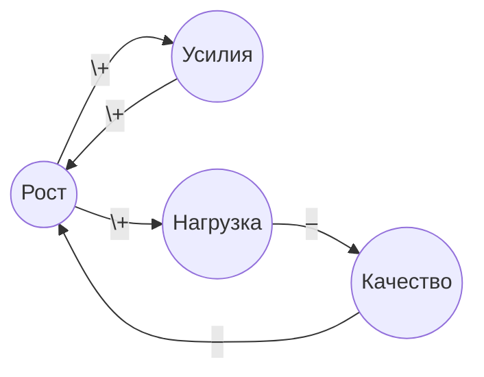
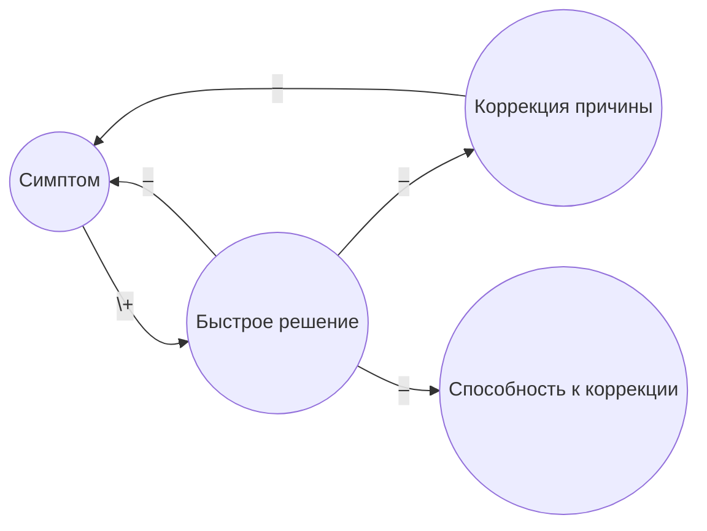
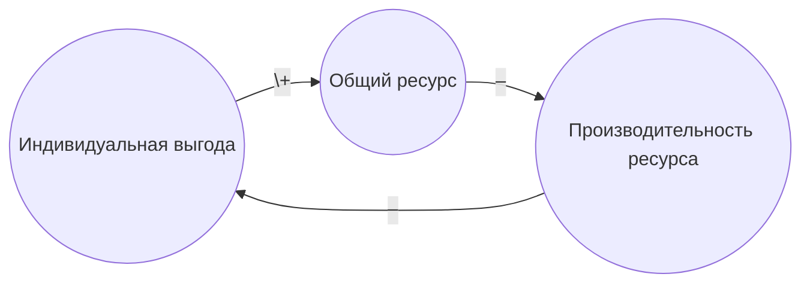
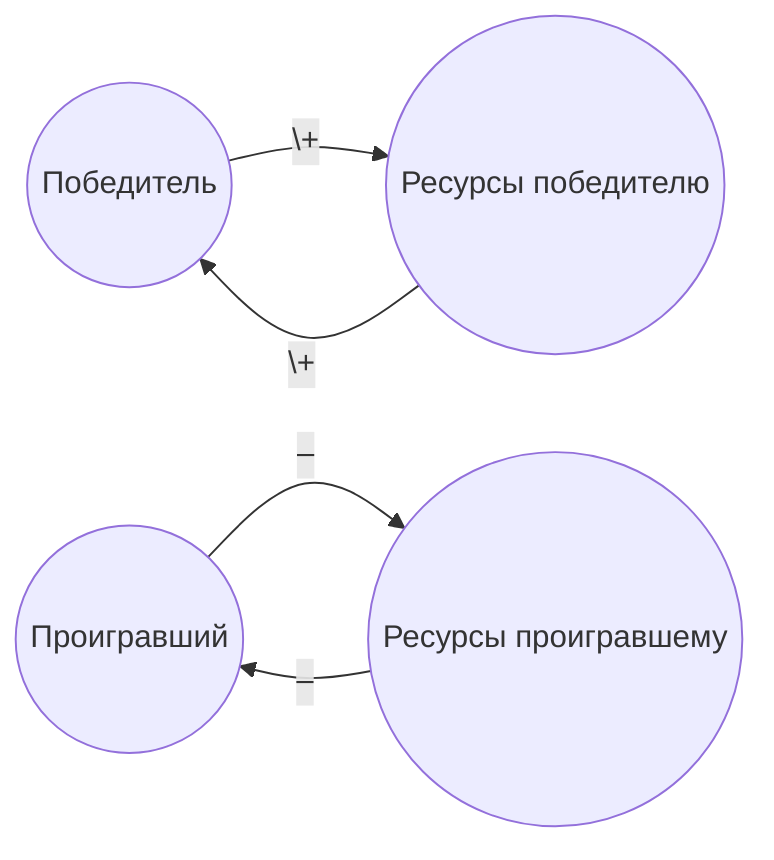
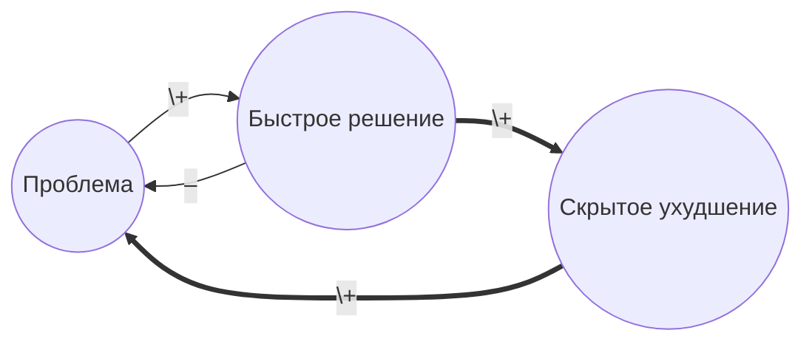
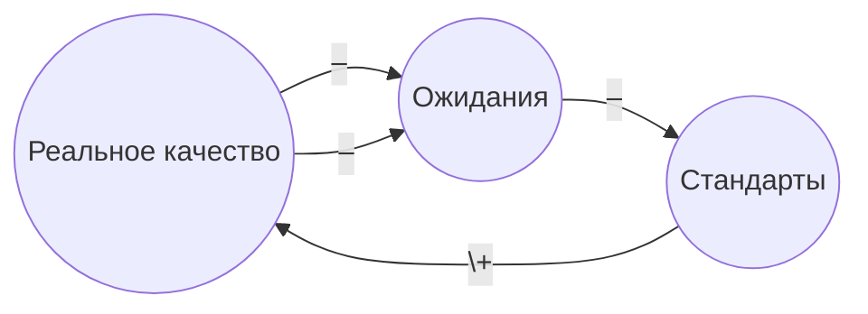
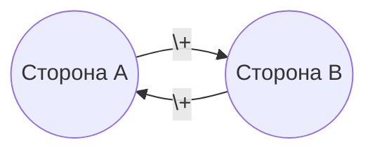
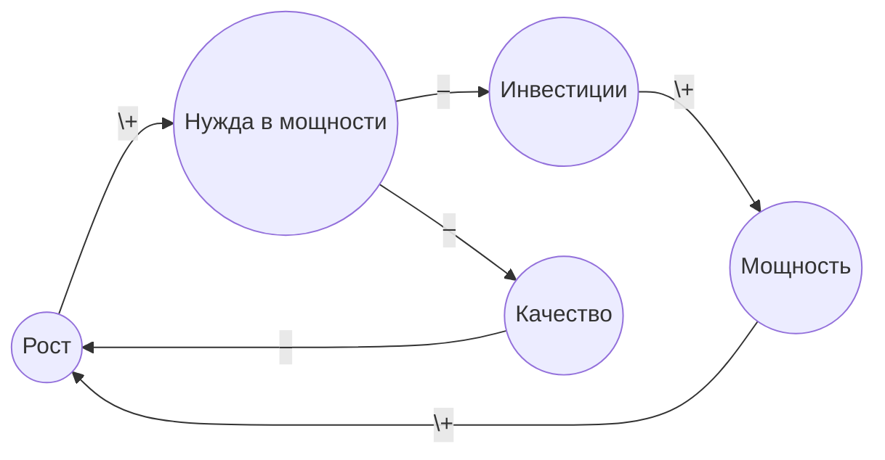

Архетипы системного поведения (systems archetypes) — это **классические "ловушки"**, в которые попадают организации, команды и даже личности. Они **повторяются в разных контекстах**, и **если научиться их распознавать — можно не попадать в них снова и снова**.

---

## 📌 Что такое архетип в системном мышлении?
> Это **характерная структура причинно-следственных связей**, которая **приводит к устойчивому, но нежелательному поведению системы**, несмотря на добрые намерения участников.

---

## 🔍  8 базовых архетипов

(**структура, поведение во времени, типичные симптомы, почему это происходит, что делать**) [TheSystemsThinker](https:\\thesystemsthinker.com)  

---

## 1. Limits to Growth (Ограничения роста)
> *"Рост замедляется не потому, что мы плохо стараемся, а потому что **система уперлась в потолок**."*

### 📊 Структура:
- **Усиливающая петля** (рост) → **Балансирующая петля** (ограничение)
- Пример: продажи растут → нагрузка на производство → снижение качества → отток клиентов

### 📈 Поведение:
- Рост → Плато → Спад (если не устранить ограничение)

### ⚠️ Симптомы:
- "Мы росли, но потом **всё остановилось**"
- "Мы добавили людей, но **эффекта нет**"

### ✅ Что делать:
- **Не давить на рост**, а **искать и устранять ограничение** (кадры, процессы, культура, технологии)

---

### CLD: Limits to Growth (Ограничения роста)

| Пояснение                                                                                                | Пример                                                                   | Точка левериджа                                                             |
| -------------------------------------------------------------------------------------------------------- | ------------------------------------------------------------------------ | --------------------------------------------------------------------------- |
| Усиливающая петля «A-B-A» даёт экспоненту, но рост повышает нагрузку → падает качество → замедляет рост. | Продажи растут → больше заказов → перегруз цеха → брак → отток клиентов. | Не давить на маркетинг, а **снять ограничение**: мощности, процессы, кадры. |

---

## 2. Shifting the Burden (Смещение бремени) 
> *"Мы лечим симптом, а не причину. И со временем **теряем способность решать проблему по-настоящему**."*

### 📊 Структура:
- **Симптом** → **Быстрое решение** (B) → **Скрытие причины** (A) → **Ухудшение способности решать A**

### 📈 Поведение:
- Проблема **возвращается всё сильнее**, а мы всё чаще используем "паллиатив"

### ⚠️ Примеры:
- Вместо обучения сотрудников — **переработки**
- Вместо стратегии — **"пожаротушение"**
- Вместо исправления процесса — **"контроль"**

### ✅ Что делать:
- **Искать корень** (A), а не бороться с симптомом (B)
- **Инвестировать в долгосрочные способности**, даже если это медленнее

---

### CLD: Shifting the Burden (Смещение бремени)

| Пояснение                                                                       | Пример                                                             | Точка левериджа                                                                          |
| ------------------------------------------------------------------------------- | ------------------------------------------------------------------ | ---------------------------------------------------------------------------------------- |
| «Быстрое» временно снимает симптом, но подрывает способность устранить причину. | Вместо обучения → переработки; усталость растёт, навыки не растут. | **Инвестировать в корень** даже если медленнее; контролировать объём «быстрого» способа. |

---

## 3. Tragedy of the Commons (Трагедия общин)
> *"Каждый рационально использует общий ресурс, но в итоге **все проигрывают**."*

### 📊 Структура:
- **Индивидуальная выгода** → **Рост нагрузки на общий ресурс** → **Деградация ресурса** → **Все страдают**

### ⚠️ Примеры:
- Все отделы "тянут" ресурсы IT → IT горит → все страдают
- Все менеджеры берут людей на проекты → **перегрузка** → **выгорание**

### ✅ Что делать:
- **Ограничения** (квоты, правила)
- **Прозрачность** и **диалог**
- **Совместное управление ресурсом**

---

### CLD: Tragedy of the Commons (Трагедия общин)

| Пояснение                                                                      | Пример                                                                       | Точка левериджа                                                                      |
| ------------------------------------------------------------------------------ | ---------------------------------------------------------------------------- | ------------------------------------------------------------------------------------ |
| Каждый рационально увеличивает нагрузку, но ресурс деградирует и страдают все. | Все отделы «берут» людей IT → команда горит → проекты всех отделов тормозят. | Установить **квоты**, **очередь**, **совместное управление ресурсом**, прозрачность. |

---

## 4. Success to the Successful (Успех ведёт к успеху)
> *"Кто победил — получает больше ресурсов. Кто проиграл — **входит в замкнутый круг неудач**."*

### 📊 Структура:
- Успех → Больше ресурсов → Ещё больше успеха  
- Неуспех → Меньше ресурсов → Ещё больше неуспеха

### ⚠️ Примеры:
- "Лучшие" сотрудники получают **все интересные задачи**
- "Лидерские" проекты получают **все инвестиции**

### ✅ Что делать:
- **Перераспределение ресурсов** (например, **вкладываться в потенциал**, а не только в результат)
- **Давать шанс тем, кто "отстаёт"**

---

### CLD: Success to the Successful (Успех → успеху)

| Пояснение                                                   | Пример                                                   | Точка левериджа                                                                              |
| ----------------------------------------------------------- | -------------------------------------------------------- | -------------------------------------------------------------------------------------------- |
| Ресурсы выделяются по текущему успеху → усиливается разрыв. | «Лидерские» проекты получают всё, «аутсайдеры» – ничего. | **Перераспределение** (инвестировать в потенциал), **разные KPI**, дать шанс наставничества. |

---

## 5. Fixes that Fail (Решения, которые ухудшают)
> *"Мы решили проблему. Но через месяц **всё стало только хуже**."*

### 📊 Структура:
- Решение → **Краткосрочное улучшение** → **Скрытое ухудшение** → **Бумеранг**

### ⚠️ Примеры:
- Урезали бюджет на обслуживание → **снизились расходы**, но **выросли поломки**
- Увольнение "лишних" → **рост переработок**, **потеря знаний**

### ✅ Что делать:
- **Смотреть на задержки**
- **Тестировать решения** и **отслеживать долгосрочные последствия**

---

### CLD: Fixes that Fail (Решение-улучшение → бумеранг)

| Пояснение                                                                           | Пример                                                                           | Точка левериджа                                                                        |
| ----------------------------------------------------------------------------------- | -------------------------------------------------------------------------------- | -------------------------------------------------------------------------------------- |
| Краткосрочное улучшение активирует скрытую петлю, которая позже усиливает проблему. | Экономия на ТО оборудования → снижение расходов, но взрыв поломок через квартал. | Учитывать **задержки**, моделировать **долгосрочные последствия**, вводить **пилоты**. |

---

## 6. Drift to Low Performance (Дрейф к низкой производительности)
> *"Мы **постепенно снижаем стандарты**, не замечая этого."*

### 📊 Структура:
- Реальное качество → **Ожидания снижаются** → **Стандарты падают** → **Качество падает ещё сильнее**

### ⚠️ Примеры:
- "Ну раз всё равно не успеваем — **перестанем планировать жёстко**"
- "Раз клиенты всё равно ругаются — **перестанем следить за качеством**"

### ✅ Что делать:
- **Фиксировать стандарты** (внешние ориентиры)
- **Регулярно сравнивать** реальность с **желаемым**, а не с "вчерашним"

---

### CLD: Drift to Low Performance (Дрейф к низким стандартам)

| Пояснение | Пример | Точка левериджа |
|-----------|--------|------------------|
| Падающее качество снижает ожидания → стандарты опускаются → качество падает ещё. | «Раз всё равно опаздываем – перестанем ставить жёсткий дедлайн». | **Фиксировать внешние ориентиры**, **не привязывать стандарты к прошлому сбою**, регулярный **аудит качества**. |

---

## 7. Escalation (Погоня за лидером)
> *"Мы **обостряем конкуренцию**, и **все проигрывают**."*

### 📊 Структура:
- A усиливает усилия → B отвечает усилением → A усиливает ещё → **спираль**

### ⚠️ Примеры:
- **Рекламные войны**
- **Гонка вооружений между отделами** (кто больше людей, бюджета, KPI)

### ✅ Что делать:
- **Остановиться первым** (если возможно)
- **Договориться** о правилах
- **Изменить правила игры** (например, совместные KPI)

---

### CLD: Escalation (Погоня/спираль усиления)

| Пояснение | Пример | Точка левериджа |
|-----------|--------|------------------|
| Каждый отвечает усилением на усиление другого → спираль. | Рекламные войны, гонка бюджетов отделов, ценовая война. | **Остановиться первым**, **изменить правила** (совместные KPI), **договориться о перемирии**. |

---

## 8. Growth and Underinvestment (Рост и недоинвестиция)
> *"Мы **не инвестируем в мощности**, потому что **рост кажется временным**, и **теряем рост**."*

### 📊 Структура:
- Рост → Недоинвестиция → Ухудшение качества → **Потеря роста**

### ⚠️ Примеры:
- Не нанимаем людей → **перегрузка** → **увольнения** → **потеря клиентов**
- Не инвестируем в IT → **сбои** → **потеря доверия**

### ✅ Что делать:
- **Инвестировать заранее**, даже если рост кажется "неустойчивым"
- **Смотреть на качество** как на **условие роста, а не как на расход**

---

### CLD: Growth and Underinvestment (Рост и недоинвестиция)

| Пояснение | Пример | Точка левериджа |
|-----------|--------|------------------|
| Рост требует мощности, но инвестиции ждут «устойчивого» спроса → качество падает → рост теряется. | Не нанимаем людей до «уверенного» роста → перегруз → увольнения → клиенты уходят. | **Инвестировать **заранее**,** **держать буфер**, **использовать качество как критерий**, а не только прибыль. |

---

### 📌 Как использовать архетипы на практике:
| Шаг                                    | Что делать                                                                                  |
| -------------------------------------- | ------------------------------------------------------------------------------------------- |
| **1. Увидеть повторяющееся поведение** | "У нас всё время так: рост → спад"                                                          |
| **2. Нарисовать структуру**            | [[Диаграмма причинно-следственных связей (Causal Loop Diagram - CLD)\|Causal Loop Diagram]] |
| **3. Определить архетип**              | "О! Это **Limits to Growth**"                                                               |
| **4. Найти** *точку приложения усилий* | Не давить на рост, а **устранить ограничение**                                              |
| **5. Тестировать**                     | Маленький эксперимент → смотрим, меняется ли структура                                      |

---
